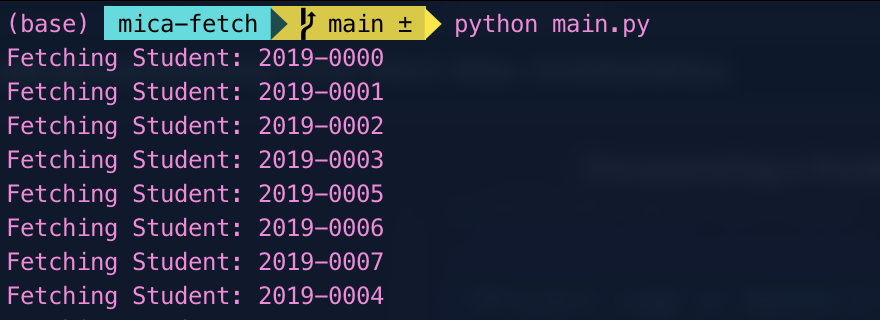
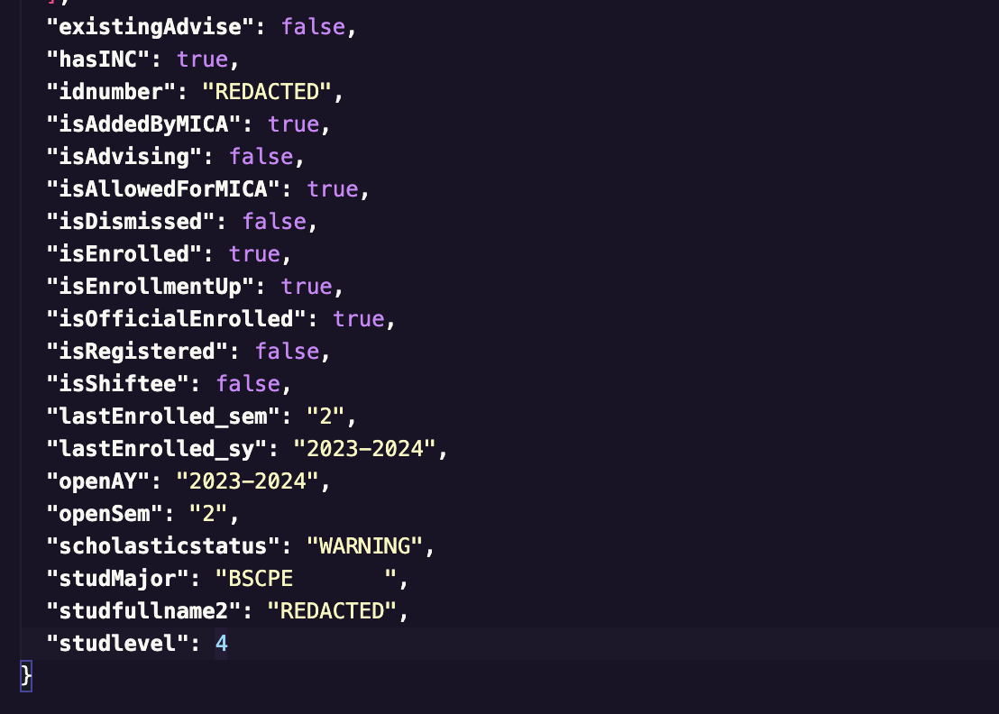
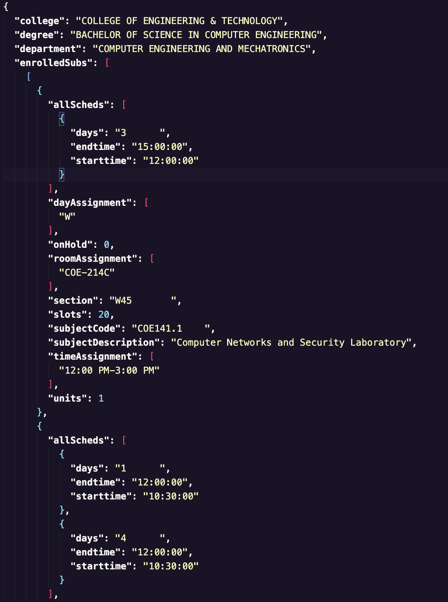
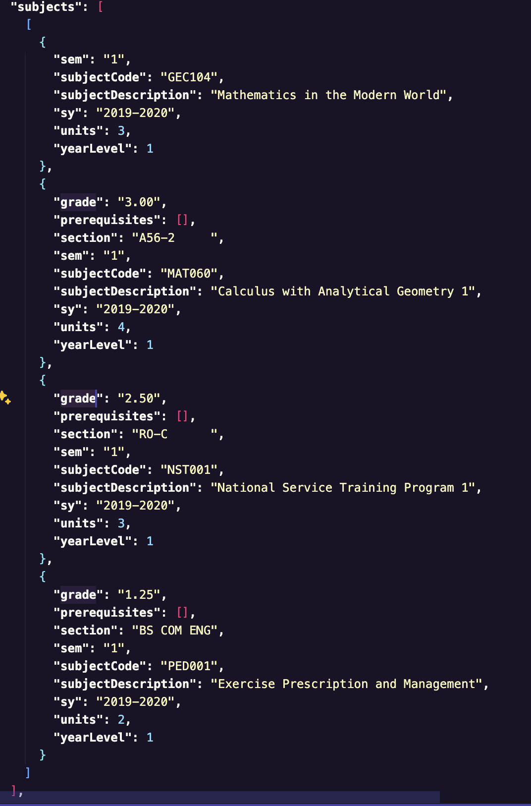

# MICA API Vulnerability: Student Data Retrieval Across ID Numbers

This Python script retrieves student information and prospectus data from the MICA API (https://micaapi.msuiit.edu.ph) for all possible student ID numbers ranging from 2018-0000 to 2024-9999. The script uses multithreading to fetch data for multiple student IDs concurrently, improving efficiency.

## Vulnerability

The provided code exploits a vulnerability in the MICA API by using an authenticated user's token to access data for all possible student ID numbers, regardless of the token owner's permissions or affiliation. This vulnerability allows an attacker to retrieve sensitive student information and prospectus data that they should not have access to.

The exposed APIs are:

- `https://micaapi.msuiit.edu.ph/api/info/v1/student/view/prospectus?studid=[idnumber]`
- `https://micaapi.msuiit.edu.ph/api/info/v2/student/get_info?studid=[idnumber]`

The script takes advantage of this vulnerability by iterating through the range of student ID numbers from 2018-0000 to 2024-9999 and making API requests with the authenticated user's token for each ID number. Ideally, the API should restrict access to student data based on the authenticated user's permissions and affiliation with the students. However, due to this vulnerability, the API fails to enforce proper access controls, allowing the script to retrieve data for any student ID number, even those the authenticated user should not have access to.

The purpose of this code is to demonstrate the existence of this vulnerability and the potential risks associated with it. However, it should be used strictly for educational and ethical purposes, such as responsible disclosure to the API providers or security research with proper authorization.


## Prerequisites

- Python 3.x

## Installation

1. Clone the repository or download the source code.
2. Install the required Python packages by running `pip install -r requirements.txt`.
3. Create a `.env` file in the project root directory with the following content:
   ```
   USERNAME=your_mica_username
   PASSWORD=your_mica_password
   ```
   Replace `your_mica_username` and `your_mica_password` with your actual MICA credentials.

## Usage

1. Run the `main.py` script: `python main.py`.
2. The script will fetch student information and prospectus data for all possible student ID numbers and store the data in the `student_info` and `prospectus` directories, respectively.

    

## Sample Output

The script fetches student information and prospectus data in JSON format and stores them in separate directories. Here's an example of the fetched data:






## Disclaimer

The authors of this code are not responsible for any misuse or consequences arising from the use of this code. Use it at your own risk.
